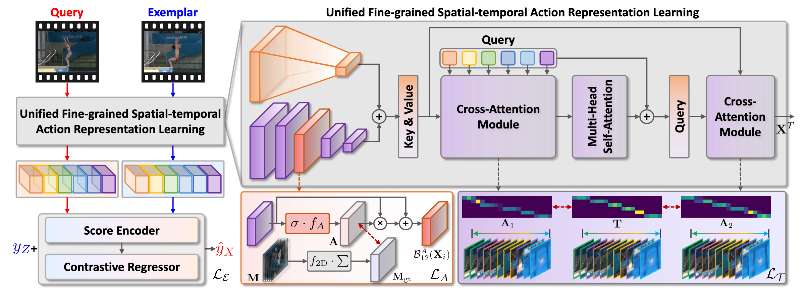

# Awesome Action Quality Assessment (AQA)

A curated list of papers, datasets, code, and SOTA benchmarks for **Action Quality Assessment (AQA)**.

---

## Contents

- [Papers by Year](#papers-by-year)
- [Benchmarks](#benchmarks)
- [Datasets](#datasets)

---

## Papers by Year

### 2025

- [TPAMI] | (Uni-FineParser) Human-centric Fine-grained Action Quality Assessment | [Paper](https://ieeexplore.ieee.org/document/10946879) | $\color{#ff7f0e}\textsf{FineDiving-HM + AQA-7-HM + MTL-AQA-HM}$ | $\color{#9467bd}\textsf{Video}$  | $\color{#d62728}{\text{Contrastive Regression}}$  
  

- [ArXiv] A Decade of Action Quality Assessment: Largest Systematic Survey of Trends, Challenges, and Future Directions. | [Paper](https://arxiv.org/abs/2502.02817) | [Project](https://arxiv.org/html/2502.02817v1) | [Code](https://github.com/HaoYin116/Survey_of_AQA/) | $\color{#2ca02c}\textsf{Survey}$
- [CVPR] BASKET 🏀 :A Large-Scale Video Dataset for Fine-Grained Skill Estimation | [Paper](https://arxiv.org/abs/2503.20781) | [Project](https://sites.google.com/cs.unc.edu/basket) | [Code](https://github.com/yulupan00/BASKET/tree/main) | $\color{#9467bd}\textsf{Video}$ | $\color{#ff7f0e}\textsf{BASKET}$  
- [TCSVT] | (ASGTN) Adaptive Spatiotemporal Graph Transformer Network for Action Quality Assessment | [Paper](https://ieeexplore.ieee.org/abstract/document/10884538) | [Code](https://github.com/jiangliu5/ASGTN_AQA) | $\color{#ff7f0e}\textsf{Fis-V + RG}$ | $\color{#9467bd}\textsf{Video}$ 
- [CVPRW] FineCausal: A Causal-Based Framework for Interpretable Fine-Grained Action Quality Assessment | [Paper](https://arxiv.org/pdf/2503.23911) | [Code](https://github.com/Harrison21/FineCausal) | $\color{#ff7f0e}\textsf{FineDiving-HM}$ | $\color{#9467bd}\textsf{Video}$ |  $\color{#d62728}{\text{Contrastive Regression}}$  
- [Arxiv] | (HP-MCoRe) Action Quality Assessment via Hierarchical Pose-guided Multi-stage Contrastive Regression | [Paper](https://arxiv.org/abs/2501.03674) | [Code](https://github.com/Lumos0507/HP-MCoRe) | $\color{#ff7f0e}\textsf{FineDiving + MTL-AQA}$ | $\color{#9467bd}\textsf{Video + Skeleton}$ |  $\color{#d62728}{\text{Contrastive Regression}}$  

### 2024

- [TCSVT] | (VATP-Net) Visual-semantic Alignment Temporal Parsing for Action Quality Assessment | [Paper](https://ieeexplore.ieee.org/document/10737230)  | $\color{#ff7f0e}\textsf{RG + FineFS + Fis-V + MTL-AQA}$ | $\color{#9467bd}\textsf{Video + Text}$ 
- [TIP] I (SAP-Net) Self-supervised subaction parsing network for semi-supervised action quality assessment | [Paper](https://ieeexplore.ieee.org/abstract/document/10706814) | $\color{#ff7f0e}\textsf{RG + FineFS + FineDiving + MTL-AQA}$ | $\color{#9467bd}\textsf{Video}$  |  $\color{#d62728}{\text{Contrastive Regression}}$  
- [NeurIPS] LucidAction: A Hierarchical and Multi-model Dataset for Comprehensive Action Quality Assessment | [Paper](https://proceedings.neurips.cc/paper_files/paper/2024/hash/aecf6978509d8b306f74c0d09508f9bc-Abstract-Datasets_and_Benchmarks_Track.html) | [Project](https://neurips.cc/virtual/2024/poster/97542) | $\color{#2ca02c}\textsf{Dataset}$
- [TCSVT] Rhythmer: Ranking-based Skill Assessment with Rhythm-aware Transformer | [Paper](https://ieeexplore.ieee.org/stamp/stamp.jsp?tp=&arnumber=10679980)
- [BMVC] | (ILT-AQA) Interpretable Long-term Action Quality Assessment | [Paper](https://arxiv.org/abs/2408.11687) | [Code](https://github.com/dx199771/Interpretability-AQA) |  $\color{#ff7f0e}\textsf{RG + Fis-V + LOGO}$ | $\color{#9467bd}\textsf{Video}$  
- [ECCV] | (TSA-MVLA) Vision-Language Action Knowledge Learning for Semantic-Aware Action Quality Assessment | [Paper](https://www.ecva.net/papers/eccv_2024/papers_ECCV/papers/05909.pdf) |  $\color{#ff7f0e}\textsf{FineDiving +  MTL-AQA + JIGSAWS + Fis-V}$ | $\color{#9467bd}\textsf{Video + Text}$  
- [ECCV] RICA2: Rubric-Informed, Calibrated Assessment of Actions | [Paper](https://arxiv.org/abs/2408.02138) |  [Project](https://abrarmajeedi.github.io/rica2_aqa/) | [Code](https://github.com/abrarmajeedi/rica2_aqa) |  $\color{#ff7f0e}\textsf{FineDiving +  MTL-AQA + JIGSAWS + Fis-V}$ | $\color{#9467bd}\textsf{Video + Text}$  
- [ECCV] MAGR: Manifold-Aligned Graph Regularization for Continual Action Quality Assessment | [Paper](https://arxiv.org/abs/2403.04398) | [Code](https://github.com/ZhouKanglei/MAGR_CAQA) | $\color{#d62728}{\text{Continual Learning}}$  
- [ECCV] Semi-Supervised Teacher-Reference-Student Architecture for Action Quality Assessment | [Paper](https://arxiv.org/abs/2407.19675)  |  $\color{#ff7f0e}\textsf{RG +  MTL-AQA + JIGSAWS}$ | $\color{#9467bd}\textsf{Video}$  
- [IJCV] | (STSA) Procedure-Aware Action Quality Assessment: Datasets and Performance Evaluation | [Paper](https://link.springer.com/article/10.1007/s11263-024-02146-z) | [Code](https://github.com/xujinglin/FineDiving) | $\color{#ff7f0e}\textsf{FineDiving + JIGSAWS}$ | $\color{#9467bd}\textsf{Video}$  |  $\color{#d62728}{\text{Contrastive Regression}}$  
- [TCSVT] Continual Action Assessment via Task-Consistent Score-Discriminative Feature Distribution Modeling | [Paper](https://arxiv.org/abs/2309.17105) | [Code](https://github.com/iSEE-Laboratory/Continual-AQA) | $\color{#ff7f0e}\textsf{MTL-AQA + AQA-7 + BEST}$ | $\color{#d62728}{\text{Continual Learning}}$  
- [IJCAI] CoFInAl: Enhancing Action Quality Assessment with Coarse-to-Fine Instruction Alignment | [Paper](https://arxiv.org/pdf/2404.13999.pdf) | [Code](https://github.com/ZhouKanglei/CoFInAl_AQA) |  $\color{#ff7f0e}\textsf{RG + Fis-V}$ | $\color{#9467bd}\textsf{Video}$  
- [CVPR Oral] FineParser: A Fine-grained Spatio-temporal Action Parser for Human-centric Action Quality Assessment | [Paper](https://arxiv.org/pdf/2405.06887#pdfjs.action=download) | [Code](https://github.com/PKU-ICST-MIPL/FineParser_CVPR2024) | | $\color{#ff7f0e}\textsf{FineDiving-HM + MTL-AQA}$ | $\color{#9467bd}\textsf{Video + Skeleton}$ |  $\color{#d62728}{\text{Contrastive Regression}}$  
- [CVPR] Narrative Action Evaluation with Prompt-Guided Multimodal Interaction | [Paper](https://arxiv.org/abs/2404.14471) | [Code](https://github.com/shiyi-zh0408/NAE_CVPR2024) |   $\color{#ff7f0e}\textsf{FineGym +  MTL-AQA}$ | $\color{#9467bd}\textsf{Video + Text}$  
- [CVPRW] Hierarchical NeuroSymbolic Approach for Comprehensive and Explainable Action Quality Assessment | [Paper](https://openaccess.thecvf.com/content/CVPR2024W/CVsports/papers/Okamoto_Hierarchical_NeuroSymbolic_Approach_for_Comprehensive_and_Explainable_Action_Quality_Assessment_CVPRW_2024_paper.pdf) | [Code](https://github.com/laurenok24/NSAQA) 
- [TIP] | (PAMFN) Multimodal Action Quality Assessment | [Paper](https://arxiv.org/abs/2402.09444) | [Code](https://github.com/qinghuannn/PAMFN) |  $\color{#ff7f0e}\textsf{RG + Fis-V}$ | $\color{#9467bd}\textsf{Video + Flow + Audio}$  
- [CVPR] A Comprehensive Survey of Action Quality Assessment: Method and Benchmark |[Paper](https://arxiv.org/abs/2412.11149) | [Project](https://zhoukanglei.github.io/AQA-Survey/)| [Code](https://github.com/ZhouKanglei/AQA-Benchmark) | $\color{#2ca02c}\textsf{Survey+Benchmark}$
- [ESWA] Vision-based human action quality assessment: A systematic review| [Paper](https://www.sciencedirect.com/science/article/pii/S0957417424025090?via%3Dihub) | $\color{#2ca02c}\textsf{Survey}$

---

## Benchmarks

**Note:** Models with an asterisk (\*) denote reproduced results, while others refer to those reported in the original papers.

### RG

|          |    Model    |   Input Data   | Ball  | Clubs | Hoop  | Ribbon | Avg.  |
| -------- | :---------: | :------------: | :---: | :---: | :---: | :----: | :---: |
|          |  C3D+SVR*   |      RGB       | 0.375 | 0.551 | 0.495 | 0.516  | 0.483 |
|          |  MS-LSTM*   |      RGB       | 0.621 | 0.661 | 0.670 | 0.695  | 0.663 |
|          | ACTION-NET* |      RGB       | 0.684 | 0.737 | 0.733 | 0.754  | 0.728 |
|          |    GDLT*    |      RGB       | 0.746 | 0.802 | 0.765 | 0.741  | 0.765 |
| TCSVT-23 |    HGCN*    |      RGB       | 0.711 | 0.789 | 0.728 | 0.703  | 0.735 |
| TIP-24   |    PAMFN    |      RGB       | 0.750 | 0.788 | 0.791 | 0.824  | 0.790 |
| TIP-24   |    PAMFN    | RGB,Flow,Audio | 0.757 | 0.825 | 0.836 | 0.846  | 0.819 |
| IJCAI-24 |   CoFInAl   |      RGB       | 0.809 | 0.806 | 0.804 | 0.810  | 0.807 |
| TCSVT-24 |  VATP-Net   |   RGB, Text    | 0.800 | 0.810 | 0.780 | 0.769  | 0.800 |
| TCSVT-25 |    ASGTN    |      RGB       | 0.792 | 0.825 | 0.784 | 0.793  | 0.799 |

### Fis-V

|          |     Model      |   Input Data   | TES   | PCS   | Avg.  |
| -------- | :------------: | :------------: | ----- | ----- | ----- |
|          |    C3D+SVR*    |      RGB       | 0.400 | 0.590 | 0.501 |
|          |    MS-LSTM*    |      RGB       | 0.660 | 0.809 | 0.744 |
|          |  ACTION-NET*   |      RGB       | 0.694 | 0.809 | 0.757 |
|          | Skating-Mixer* |      RGB       | 0.680 | 0.820 | 0.759 |
|          |     GDLT*      |      RGB       | 0.685 | 0.820 | 0.761 |
|          |   LUSD-NET*    |      RGB       | 0.679 | 0.823 | 0.760 |
|          |      SGN*      |      RGB       | 0.700 | 0.830 | 0.773 |
| TCSVT-23 |     HGCN*      |      RGB       | 0.246 | 0.221 | 0.234 |
| ICCV-21  |     CoRe*      |      RGB       | 0.660 | 0.820 | 0.750 |
| ECCV-22  |      TPT*      |      RGB       | 0.570 | 0.760 | 0.677 |
| TIP-24   |     PAMFN      |      RGB       | 0.742 | 0.867 | 0.814 |
| TIP-24   |     PAMFN      | RGB,Flow,Audio | 0.754 | 0.872 | 0.822 |
| IJCAI-24 |    CoFInAl     |      RGB       | 0.716 | 0.843 | 0.788 |
| TCSVT-24 |    VATP-Net    |      RGB       | 0.702 | 0.863 | 0.796 |
| TCSVT-25 |     ASGTN      |      RGB       | 0.703 | 0.845 | 0.784 |

### FineFS

**SP**

|           |   Model   | Input Data | TES (ρ) | PCS (ρ) | Avg. (ρ) |
| :-------: | :-------: | :--------: | :-----: | :-----: | :------: |
|     -     | Ms-LSTM*  |    RGB     |  0.547  |  0.602  |  0.575   |
| ACM MM-21 | TSA-Net*  |    RGB     |  0.657  |  0.696  |  0.677   |
|  CVPR-22  |   TSA*    |    RGB     |  0.529  |  0.776  |  0.671   |
|     -     |   GDLT*   |    RGB     |  0.644  |  0.783  |  0.721   |
|     -     | LUSD-Net* |    RGB     |  0.689  |  0.813  |  0.758   |
| TCSVT2024 | VATP-Net  |  RGB,Text  |  0.691  |  0.809  |  0.750   |

**FS**

|   Year    |   Model   | Input Data | TES (ρ) | PCS (ρ) | Avg. (ρ) |
| :-------: | :-------: | :--------: | :-----: | :-----: | :------: |
|     -     | Ms-LSTM*  |    RGB     |  0.552  |  0.615  |  0.584   |
| ACM MM-21 | TSA-Net*  |    RGB     |  0.663  |  0.704  |  0.684   |
|  CVPR-22  |   TSA*    |    RGB     |  0.675  |  0.779  |  0.730   |
|     -     |   GDLT*   |    RGB     |  0.633  |  0.800  |  0.727   |
|     -     | LUSD-Net* |    RGB     |  0.779  |  0.863  |  0.826   |
| TCSVT2024 | VATP-Net  |  RGB,Text  |  0.721  |  0.868  |  0.795   |

### LOGO

|         |   Model    | Input Data | ρ (Spearman) |  RL2  |
| :-----: | :--------: | :--------: | :----------: | :---: |
| CVPR-20 |    USDL    |    RGB     |    0.473     | 5.076 |
| ICCV-21 |    CoRe    |    RGB     |    0.500     | 5.960 |
|    -    |    TSA     |    RGB     |    0.475     | 4.778 |
|    -    | ACTION-NET |    RGB     |    0.410     | 5.569 |
|    -    | USDL-GOAT  |    RGB     |    0.535     | 5.022 |
|    -    |  TSA-GOAT  |    RGB     |    0.484     | 5.409 |
|    -    | CoRe-GOAT  |    RGB     |    0.560     | 4.763 |

###  FineDiving

|          |  Model   |  Input Data   | ρ (Spearman) |  RL2   |
| :------: | :------: | :-----------: | :----------: | :----: |
| CVPR-20  |  USDL*   |      RGB      |    0.8504    | 0.583  |
| CVPR-20  |  MUSDL*  |      RGB      |    0.8978    | 0.370  |
| ICCV-21  |  CoRe*   |      RGB      |    0.9061    | 0.361  |
|   2022   |   TSA*   |      RGB      |    0.9203    | 0.342  |
|   2024   |  MCoRe*  |      RGB      |    0.9232    | 0.326  |
|   2024   | HP-MCoRe | RGB, Skeleton |    0.9365    | 0.244  |
| TIP2024  | SAP-Net  |      RGB      |    0.9482    |        |
| ECCV2024 | TSA-MVLA |   RGB, Text   |    0.9419    | 0.2840 |

### MTL-AQA

|          |  Model   |  Input Data   | ρ (Spearman) |  RL2  |
| :------: | :------: | :-----------: | :----------: | :---: |
| CVPR-20  |  USDL*   |      RGB      |    0.9231    | 0.468 |
|   2020   |  MUSDL*  |      RGB      |    0.9273    | 0.451 |
| ICCV-21  |  CoRe*   |      RGB      |    0.9423    | 0.336 |
|   2021   | TSA-Net* |      RGB      |    0.9422    |   -   |
| TCSVT-23 |  H-GCN*  |      RGB      |    0.9463    | 0.311 |
|   2024   | HP-MCoRe | RGB, Skeleton |    0.9432    | 0.351 |
| TCSVT-24 | VATP-Net |   RGB, Text   |    0.9588    |   -   |
|  TIP-24  | SAP-Net  |      RGB      |    0.9638    |       |
| ECCV-24  | TSA-MVLA |   RGB, Text   |    0.9597    | 0.229 |

###  AQA-7-HM

|           |     Model      | Diving | Gym Vault | BigSki. | BigSnow. | Sync. 3m | Sync. 10m | Avg. ρ |
| :-------: | :------------: | :----: | :-------: | :-----: | :------: | :------: | :-------: | ------ |
|   2014    |   Pose+DCT*    | 0.5300 |  0.1000   |    -    |    -     |    -     |     -     | -      |
|   2017    |   C3D-LSTM*    | 0.6047 |  0.5636   | 0.4593  |  0.5029  |  0.7912  |  0.6927   | 0.6165 |
|   2017    |    C3D-SVR*    | 0.7902 |  0.6824   | 0.5209  |  0.4006  |  0.5937  |  0.9120   | 0.6937 |
|   2018    |    ST-GCN*     | 0.3286 |  0.5770   | 0.1681  |  0.1234  |  0.6600  |  0.6483   | 0.4433 |
|   2019    |      JRG*      | 0.7630 |  0.7358   | 0.6006  |  0.5405  |  0.9013  |  0.9254   | 0.7849 |
|   2020    |     USDL*      | 0.8099 |  0.7570   | 0.6538  |  0.7109  |  0.9166  |  0.8878   | 0.8102 |
|  ICCV-21  |     CoRe*      | 0.8824 |  0.7746   | 0.7115  |  0.6624  |  0.9442  |  0.9078   | 0.8401 |
|   2021    |    TSA-Net*    | 0.8379 |  0.8004   | 0.6657  |  0.6962  |  0.9493  |  0.9334   | 0.8476 |
|   2022    |      TPT*      | 0.8969 |  0.8043   | 0.7336  |  0.6965  |  0.9456  |  0.9545   | 0.8715 |
|   2024    |   FineParser   | 0.8645 |  0.7429   | 0.4615  |  0.5867  |  0.9158  |  0.9112   | 0.7967 |
| TPAMI2024 | Uni-FineParser | 0.9180 |  0.8051   | 0.7614  |  0.6639  |  0.9407  |  0.9605   | 0.8773 |

|   Year   |     Model      | Diving | Gym Vault | BigSki. | BigSnow. | Sync. 3m | Sync. 10m | Avg. R-ℓ2 |
| :------: | :------------: | :----: | :-------: | :-----: | :------: | :------: | :-------: | :-------: |
|   2017   |    C3D-SVR*    |  1.53  |   3.12    |  6.79   |   7.03   |  17.84   |   4.83    |   6.86    |
|   2020   |     USDL*      |  0.79  |   2.09    |  4.82   |   4.94   |   0.65   |   2.14    |   2.57    |
| ICCV-21  |     CoRe*      |  0.64  |   1.78    |  3.67   |   3.87   |   0.41   |   2.35    |   2.12    |
|   2022   |      TPT*      |  0.53  |   1.69    |  2.89   |   3.30   |   0.33   |   1.33    |   1.68    |
|   2024   |   FineParser   |  0.77  |   2.08    |  7.39   |   4.18   |   0.74   |   2.17    |   2.89    |
| TPAMI-25 | Uni-FineParser |  0.43  |   1.86    |  3.28   |   3.37   |   0.54   |   0.81    |   1.72    |

###  MTL-AQA-HM

|   Year   |     Model      | Input Data | ρ (Spearman) | R-ℓ2 (×100) |
| :------: | :------------: | :--------: | :----------: | :---------: |
|   2014   |   Pose+DCT*    |    RGB     |    0.2682    |      -      |
|   2017   |    C3D-SVR*    |    RGB     |    0.7716    |      -      |
|   2017   |   C3D-LSTM*    |    RGB     |    0.8489    |      -      |
|   2019   |  C3D-AVG-STL*  |    RGB     |    0.8960    |      -      |
|   2019   |  C3D-AVG-MTL*  |    RGB     |    0.9044    |      -      |
|   2020   |     USDL*      |    RGB     |    0.9231    |   0.4680    |
|   2020   |     MUSDL*     |    RGB     |    0.9273    |   0.4510    |
|   2021   |    TSA-Net*    |    RGB     |    0.9422    |      -      |
|   2021   |     CoRe*      |    RGB     |    0.9512    |   0.2600    |
|   2022   |      TPT*      |    RGB     |    0.9607    |   0.2378    |
|   2024   |      NAE*      |    RGB     |    0.9430    |   0.3400    |
|   2024   |     RICA2*     |    RGB     |    0.9594    |   0.2580    |
| CVPR-24  |   FineParser   |    RGB     |    0.9585    |   0.2411    |
| TPAMI-25 | Uni-FineParser |    RGB     |    0.9622    |   0.2299    |

###  FineDiving-HM

|   Year   |     Model      | Input Data | ρ (Spearman) | R-ℓ2 (×100) |
| :------: | :------------: | :--------: | :----------: | :---------: |
|   2017   |   C3D-LSTM*    |    RGB     |    0.6969    |   1.0767    |
|   2019   |    C3D-AVG*    |    RGB     |    0.8371    |   0.6251    |
|   2019   |    MSCADC*     |    RGB     |    0.7688    |   0.9327    |
|   2020   |    I3D+MLP*    |    RGB     |    0.8776    |   0.4967    |
|   2020   |     USDL*      |    RGB     |    0.8830    |   0.4800    |
|   2020   |     MUSDL*     |    RGB     |    0.9241    |   0.3474    |
| ICCV-21  |     CoRe*      |    RGB     |    0.9308    |   0.3148    |
|   2022   |      TSA*      |    RGB     |    0.9324    |   0.3022    |
|   2022   |      TPT*      |    RGB     |    0.9475    |   0.2413    |
|   2024   |     STSA*      |    RGB     |    0.9397    |   0.2707    |
| ECCV-24  |   TSA-MVLA*    |    RGB     |    0.9419    |   0.2840    |
|   2024   |     RICA2*     |    RGB     |    0.9402    |   0.2838    |
| CVPR-24  |   FineParser   |    RGB     |    0.9435    |   0.2602    |
| CVPRW-25 |   FineCausal   |    RGB     |    0.9447    |   0.2338    |
| TPAMI-25 | Uni-FineParser |    RGB     |    0.9501    |   0.2294    |

## Datasets

| Dataset             | Year | Scene          | Classes | Samples | Avg. Frames                                                | Data Modality                | Annotation Granularity               | Link                                                         |
| ------------------- | ---- | -------------- | :-----: | ------- | ---------------------------------------------------------- | ---------------------------- | ------------------------------------ | ------------------------------------------------------------ |
| BASKET              | 2025 | Sports         |    1    | 32232   | 500(s)                                                     | Video                        |                                      | [link](https://sites.google.com/cs.unc.edu/basket)           |
| LOGO                | 2023 | Sports         |   12    | 200     | 5100                                                       | Video                        | Action class, formation, score       | [link](https://github.com/shiyi-zh0408/LOGO)                 |
| MMASD               | 2023 | Behaviour      |   11    | 1315    | --                                                         | 2D/3D Skeleton, Optical Flow | Fine-grained skill segments          | [link](https://github.com/Li-Jicheng)                        |
| FineFS              | 2023 | Sports         |    1    | 1167    | 5000                                                       | Video, 2D/3D Skeleton        | Subaction class, score, segmentation | [link](https://github.com/yanliji/FineFS-dataset)            |
| PaSk                | 2023 | Sports         |    1    | 1018    | --                                                         | Video                        | Frame-level label                    | -                                                            |
| NETS                | 2022 | Skill          |    1    | 100     | --                                                         | Video                        | Relative rank                        | -                                                            |
| FineDiving          | 2022 | Sports         |    1    | 3000    | 105                                                        | Video                        | Step-level score + overall           | [link](https://github.com/xujinglin/FineDiving)              |
| PISA                | 2021 | Skill          |    1    | 992     | 160                                                        | Video                        | Skill level, difficulty              | [link](https://github.com/ParitoshParmar/Piano-SkillsAssessment) |
| TASD-2              | 2020 | Sports         |    2    | 606     | 300                                                        | Video                        | Difficulty, Execution                | [link](https://www.isee-ai.cn/~gaojibin/ProjectAIM.html)     |
| Rhythmic Gymnastics | 2020 | Sports         |    4    | 1000    | 2375                                                       | Video                        | Overall score                        | [link](https://github.com/qinghuannn/ACTION-NET)             |
| FIS-V               | 2019 | Sports         |    1    | 500     | 4300                                                       | Video                        | TES, PCS sub-scores                  | [link](https://github.com/loadder/MS_LSTM)                   |
| MTL-AQA             | 2019 | Sports         |   16    | 1412    | 96                                                         | Video                        | Overall score                        | [link](https://github.com/ParitoshParmar/MTL-AQA)            |
| AQA-7               | 2019 | Sports         |    7    | 1189    | Dive: 97–156, Vault: 87, Big Air: 122–132, Trampoline: 634 | Video                        | Overall score                        | [link](http://rtis.oit.unlv.edu/datasets.html)               |
| UI-PRMD             | 2018 | Rehabilitation |   10    | 100     | --                                                         | Kinematic                    | Binary quality label                 | [link](https://webpages.uidaho.edu/ui-prmd/)                 |
| Walking Gait        | 2018 | Rehabilitation |    9    | 81      | --                                                         | Kinematic                    | Gait labels                          | [link](http://wwwlabs.iro.umontreal.ca/labimage/GaitDataset/) |
| UMONS-TAICHI        | 2018 | Exercise       |   13    | 2200    | --                                                         | Kinematic                    | Coarse (no skill score)              | [link](https://github.com/numediart/UMONS-TAICHI)            |
| UNLV-Diving         | 2017 | Sports         |    1    | 171     | Dive: 150                                                  | Video                        | Overall score                        | [link](http://rtis.oit.unlv.edu/datasets.html)               |
| UNLV-Skating        | 2017 | Sports         |    1    | 176     | Figure Skate: 4200                                         | Video                        | Overall score                        | [link](http://rtis.oit.unlv.edu/datasets.html)               |
| UNLV-Vault          | 2017 | Sports         |    1    | 370     | Vault: 75                                                  | Video                        | Overall score                        | [link](http://rtis.oit.unlv.edu/datasets.html)               |
| JIGSAWS             | 2014 | Skill          |    3    | 103     | --                                                         | Video, Kinematic             | Step-level (surgeme) + global rating | [link](https://cirl.lcsr.jhu.edu/research/hmm/datasets/jigsaws_release/) |
| MIT Olympics        | 2014 | Sports         |    2    | 309     | Dive: 150, Figure Skate: 4200                              | Video                        | Overall score                        | [link](https://redirect.cs.umbc.edu/hpirsiav/quality.html)   |

